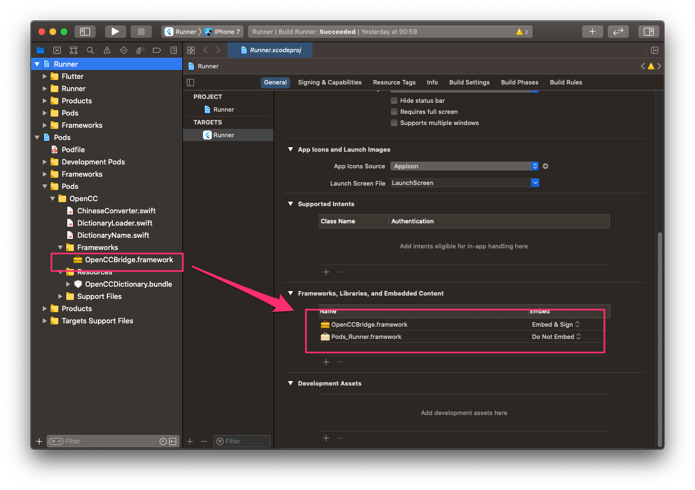

# flutter_open_chinese_convert

flutter_open_chinese_convert bridges OpenCC (開放中文轉換) to your Flutter
projects. You can use the package to convert Traditional Chinese to Simplified
Chinese, and vise versa.

The package supports various conversion options:

- S2T: Simplified Chinese to Traditional Chinese.
- T2S: Traditional Chinese to Simplified Chinese.
- S2HK: Simplified Chinese to Traditional Chinese (Hong Kong Standard).
- HK2S: Traditional Chinese (Hong Kong Standard) to Simplified Chinese.
- S2TW: Simplified Chinese to Traditional Chinese (Taiwan Standard).
- TW2S: Traditional Chinese (Taiwan Standard) to Simplified Chinese.
- S2TWp: Simplified Chinese to Traditional Chinese (Taiwan Standard) with Taiwanese idiom.
- TW2Sp: Traditional Chinese (Taiwan Standard) to Simplified Chinese with Mainland Chinese idiom.

## Usage

All you need to do is to call `ChineseConverter.convert` with what you wan to
convert and a conversion option. For example:

``` dart
import 'package:flutter_open_chinese_convert/flutter_open_chinese_convert.dart';

var text = '鼠标里面的硅二极管坏了，导致光标分辨率降低。';
var result = await ChineseConverter.convert(text, S2TWp());
// 滑鼠裡面的矽二極體壞了，導致游標解析度降低。
```

For further information, please visit:

- [OpenCC Project](https://github.com/BYVoid/OpenCC)
- [SwiftyOpenCC](https://github.com/ddddxxx/SwiftyOpenCC)
- [android-opencc](https://github.com/qichuan/android-opencc)

## Using flutter_open_chinese_convert with Xcode 12

flutter_open_chinese_convert uses a prebuilt framework `OpenCCBridge` and a
CocoaPods spec for iOS. It seems that Xcode 12 does not automatically embed the
frameworks that we use "vendored_frameworks" that we ask Xcode 12 to embed, and
you may encounter an error like

```
dyld: Library not loaded: @rpath/OpenCCBridge.framework/OpenCCBridge
Referenced from: /Users/ken/Library/Developer/CoreSimulator/Devices/BCD237D5-ABBE-4F6E-9C79-506BA06E3B53/data/Containers/Bundle/Application/AF95F373-24A8-4345-A76B-82F98B0D2558/Runner.app/Runner
Reason: image not found
```

To fix the issue, open your Xcode workspace, and drag `OpenCCBridge.framework`
to your app target, the like following image.


